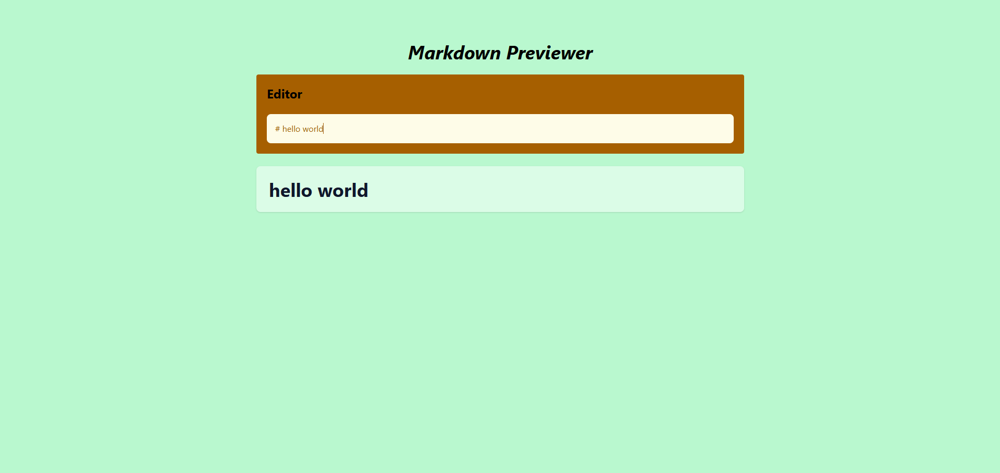

# Markdown Previewer

This is a solution to the Markdown Previewer challenge on freeCodeCamp.

---

## Table of contents

- [Overview](#overview)
    - [The challenge](#the-challenge)
    - [Screenshot](#screenshot)
    - [Links](#links)
- [My process](#my-process)
    - [Built with](#built-with)
    - [What I learned](#what-i-learned)
- [Author](#author)

---

## Overview

### The challenge

Users should be able to:

- Enter Markdown text into a textarea editor
- See a live preview of the rendered HTML in real time
- View properly formatted headings (H1–H6)
- See styled inline code and code blocks
- View lists, links, bold text, and other Markdown elements correctly rendered
- Experience a responsive layout across different screen sizes

---

### Screenshot



---

### Links

- Solution URL: [Github repo](https://github.com/S4V10N/markdown-preview-app.git)
- Live Site URL: [Live preview](https://markdown-preview-app-eight.vercel.app/)

---

## My process

### Built with

- React
- Tailwind CSS v4
- Tailwind Typography (`@tailwindcss/typography`)
- Vite
- Marked.js (ESM via CDN)
- Semantic HTML5 markup

---

### What I learned

This project helped me strengthen my understanding of:

- React state management using `useState`
- Rendering dynamic HTML safely using `dangerouslySetInnerHTML`
- Converting Markdown to HTML using `marked.parse()`
- Styling rendered HTML content using Tailwind's `prose` utility
- Customizing typography styles directly with utility classes
- Structuring clean responsive layouts using Flexbox in Tailwind
- Integrating external libraries via CDN in a modern Vite setup

Below is a key snippet used to convert Markdown into HTML:

```js
import { marked } from "https://cdnjs.cloudflare.com/ajax/libs/marked/16.3.0/lib/marked.esm.js";

useEffect(() => {
    setHtml(marked.parse(markdown));
}, [markdown]);
```

## Author

- Website [S4](https://savion.dev)
- Frontend Mentor [S4V10N](https://www.frontendmentor.io/profile/S4V10N)
- Twitter [Dev Savion](https://x.com/dev_savion?s=21)
